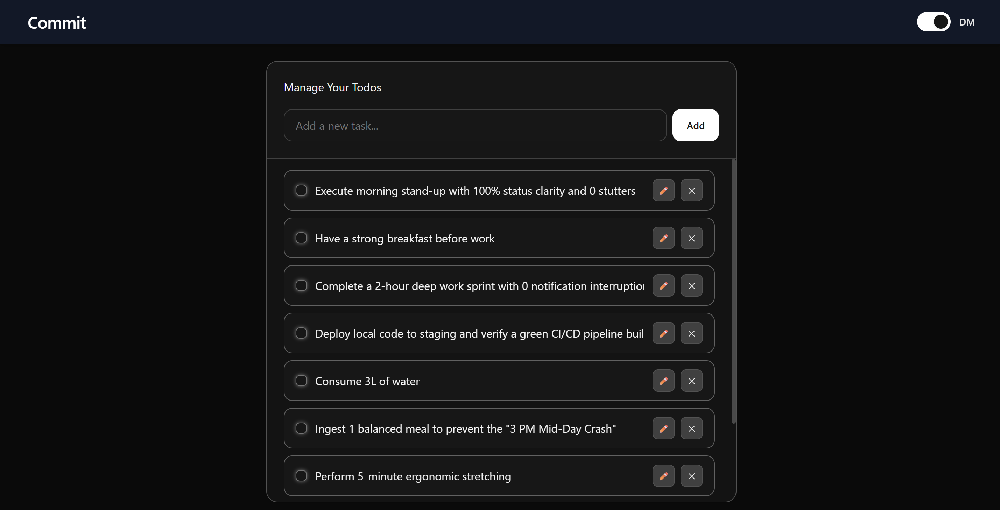

# Commit: A Minimal, Context-Driven Todo App

## Overview

**Commit** is a clean, modern todo application built with React and Tailwind CSS, focused on simplicity, usability, and thoughtful state management.

The application demonstrates how to build a **fully functional CRUD system** using React Context API while maintaining a polished UI and smooth user experience. It emphasizes **separation of concerns, predictable state updates, and real-world UX decisions** like inline editing and persistent state.

---

## Live Demo
Introducing to you: [Commit](https://commit-pi.vercel.app/)

## Preview


## Features

### Core Functionality

* Add new todos
* Edit todos inline
* Delete todos
* Toggle completion status
* Persistent state using `localStorage`

### User Experience

* Inline editing with auto-focus
* Disabled editing for completed tasks
* Smooth transitions and micro-interactions
* Sticky input header for continuous task entry
* Scrollable task container

### Theme System

* Light / Dark mode toggle
* Theme persisted in `localStorage`
* Tailwind-based dark mode using class strategy

---

## Tech Stack

### Frontend

* React (v19)
* Tailwind CSS (v4)
* Vite (build tool)

### State Management

* React Context API (global state)
* Local component state for UI control

### Tooling

* ESLint for code quality
* Vite for fast development and builds

---

## Project Structure

```
src/
│
├── components/
│   ├── Navbar.jsx
│   ├── ThemeBtn.jsx
│   ├── TodoForm.jsx
│   └── TodoItem.jsx
│
├── context/
│   ├── ThemeContext.js
│   └── TodoContext.js
│
├── App.jsx
├── index.css
└── main.jsx
```

---

## Architecture & Design Decisions

### 1. Context-Based State Management

Global state is handled using two separate contexts:

* `TodoContext` → manages all todo operations and state
* `ThemeContext` → manages UI theme

This avoids prop drilling and keeps components focused and reusable.

---

### 2. Immutable State Updates

All operations (`add`, `update`, `delete`, `toggle`) use immutable patterns:

```js
setTodos(prev => prev.map(...))
```

This ensures predictable rendering and avoids side effects.

---

### 3. Controlled Editing System

Editing is managed globally using:

```js
editingTodoId
```

Only one todo can be edited at a time, ensuring:

* Cleaner UX
* Reduced UI complexity
* Better focus management

---

### 4. Persistence Layer

The app uses `localStorage` for persistence:

* Todos are saved on every update
* Restored on initial load
* Theme preference is also persisted

---

### 5. UI/UX Philosophy

* Minimal, distraction-free interface
* Apple-inspired clean layout
* Subtle animations and transitions
* Functional over decorative design

---

## Installation & Setup

### 1. Clone the repository

```bash
git clone https://github.com/sagarpani/Commit.git
cd commit
```

### 2. Install dependencies

```bash
npm install
```

### 3. Run development server

```bash
npm run dev
```

### 4. Build for production

```bash
npm run build
```

### 5. Preview production build

```bash
npm run preview
```

---

## Scripts

```json
"dev": "vite",
"build": "vite build",
"lint": "eslint .",
"preview": "vite preview"
```

---

## Key Learnings

* Designing scalable state using Context API
* Managing UI state vs global state effectively
* Handling controlled inputs and inline editing
* Implementing persistent storage in frontend apps
* Building responsive UI with Tailwind CSS
* Structuring a React app for clarity and maintainability

---

## Limitations

* No backend (data stored only in browser)
* No authentication or multi-user support
* No unit or integration tests
* Performance not optimized for very large datasets

---

## Future Improvements

* Backend integration (Node.js / Spring Boot)
* User authentication system
* Drag-and-drop task reordering
* Due dates and task categorization
* Search and filtering
* Mobile-first UI refinements
* Add testing (Jest / React Testing Library)

---

## Author
Sagar Pani<br>
LinkedIn: [Sagar Pani](https://www.linkedin.com/in/sagarpani/)<br>

FullStack Developer (in progress) <br>
Learning ReactJs + Vite, Tailwind <br>
Building projects to learn deeply, not just to make them work.
